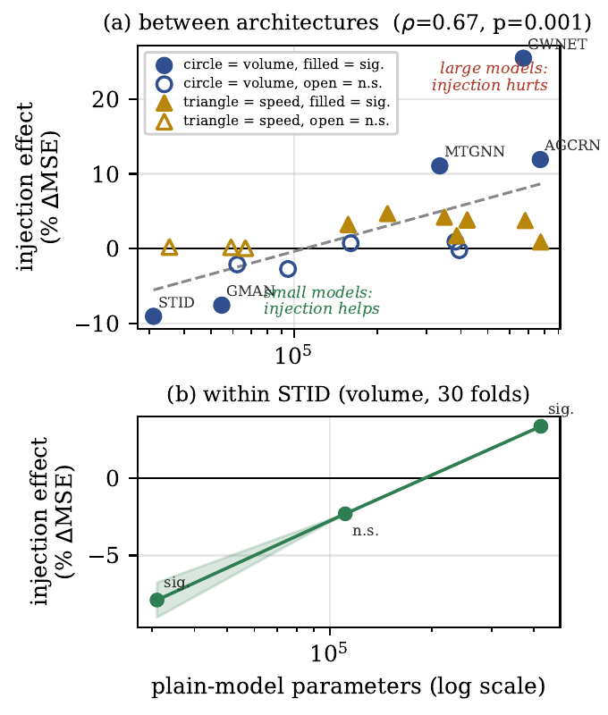
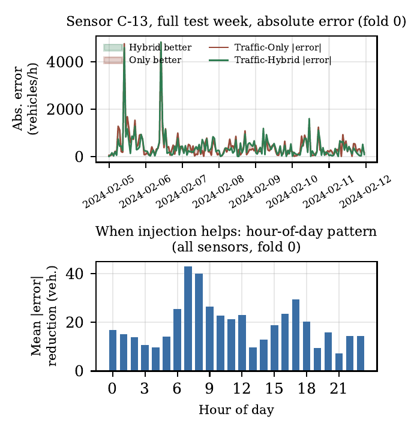

# When Does Population-Mobility OD Injection Help Traffic Forecasting?

### A Capacity-Gap Account and a Validation-Gated Remedy

Code, analysis scripts, and result summaries for a submission to *IEEE Transactions on Knowledge
and Data Engineering* (TKDE). Raw data and trained checkpoints are not included (see
[`data/README.md`](data/README.md)) — this repo has the code that produced every number and
figure in the paper, plus the aggregated result files themselves.

- **Paper (main body):** [`paper/main.pdf`](paper/main.pdf)
- **Supplementary material (Appendices A–E):** [`paper/supplement.pdf`](paper/supplement.pdf)
- **arXiv:** _add link once posted_

---

## Abstract

Road traffic is a downstream consequence of population movement, so forecasted
origin–destination (OD) flow, routed onto the road network, should carry predictive information a
traffic-only model lacks. Under 30-fold rolling-origin validation on Seoul's city-wide
population-flow data (500 administrative units, 2023–2026, volume on 121 sensors and speed on
396), injecting a routed OD forecast through a learned per-node, per-timestep gate reduces a
lightweight graph-recurrent model's MSE by 6.5–8.3% (p<10⁻⁵). Applied uniformly to ten published
architectures spanning 32k–774k parameters, however, the same mechanism helps only the two
smallest and is significantly *harmful* above 10⁵ parameters (Spearman ρ=0.89, p=5×10⁻⁴) — a
capacity-gap pattern a within-architecture sweep and three further public benchmarks (PEMS-BAY,
METR-LA, PeMSD7) both reproduce. This is not where the paper stops: a per-sensor selector, chosen
from each fold's validation split alone and requiring no retraining, recovers significant
improvement in thirteen of fourteen architecture/task combinations — including four where uniform
injection was significantly harmful — and nearly doubles the one case already favorable, turning a
mechanism that fails to generalize into a practical, checkpoint-level fix that does.

## Key results

**The capacity-gap.** Injecting the routed OD signal into ten published spatiotemporal
architectures (32k–774k parameters): the two smallest benefit, everything above ~10⁵ parameters is
null or significantly harmful.



| Model | Params | Volume Δ (wins, p) | Speed Δ (wins, p) |
|---|---:|---|---|
| STID | 31,028 | **−9.02%** (30/30, 1.7e-10) | +0.24% (11/30, 0.57) |
| GMAN | 54,748 | **−7.53%** (22/30, 0.002) | +0.19% (14/30, 0.79) |
| STGCN | 62,236 | −2.09% (20/30, 0.83) | +0.09% (16/30, 0.93) |
| PDFormer | 94,988 | −2.70% (23/30, 0.27) | **+3.25%** (2/30, 1e-8) |
| STAEformer | 159,996 | +0.74% (14/30, 0.48) | **+4.71%** (1/30, 5e-10) |
| MTGNN | 335,452 | **+11.07%** (3/30, 5e-5) | **+4.24%** (0/30, 7e-14) |
| DCRNN | 381,916 | +0.95% (14/30, 0.25) | **+1.76%** (11/30, 0.011) |
| GTS | 394,853 | −0.19% (16/30, 0.88) | **+3.86%** (3/30, 5e-9) |
| GWNET | 672,656 | **+25.45%** (1/30, 4e-9) | **+3.77%** (5/30, 1e-5) |
| AGCRN | 773,830 | **+11.92%** (3/30, 5e-6) | **+0.91%** (11/30, 0.027) |

(full source: [`results/summaries/`](results/summaries/), generated by the `multi_fold_baseline_*`
training runs and aggregated in [`figures/scripts/make_fig_capacity_law.py`](figures/scripts/make_fig_capacity_law.py))

**The fix: selective, validation-gated injection.** Per-sensor selector — plain vs. injected
checkpoint, chosen by that fold's own validation MSE, no retraining — extended to 14
(architecture, task) combinations:

| Model | Task | Selective Δ | Uniform Δ |
|---|---|---|---|
| DCRNN | volume | **−4.06%** | +0.95% |
| DCRNN | speed | **−1.51%** | **+1.76%** |
| GWNET | volume | −0.46% (ns) | **+25.45%** |
| GWNET | speed | **−1.87%** | **+3.77%** |
| GTS | volume | **−5.10%** | −0.19% |
| GTS | speed | **−1.44%** | **+3.86%** |
| GMAN | volume | **−14.14%** | **−7.53%** |
| GMAN | speed | **−5.54%** | +0.19% |
| STAEformer | volume | **−4.49%** | +0.74% |
| STAEformer | speed | **−1.23%** | **+4.71%** |
| STGCN | volume | **−7.84%** | −2.09% |
| STGCN | speed | **−3.73%** | +0.09% |
| STID | volume | **−10.00%** | **−9.02%** |
| STID | speed | **−3.39%** | +0.24% |

13 of 14 significant and favorable; GWNET/volume is the one exception, and stays an exception
under a random-selection negative control, a seed-only "free lunch" correction, and an
adaptive noise-calibrated threshold (all three checks are in [`analysis/`](analysis/)).

**Qualitative case study** — where injection actually helps (morning-commute peak, one sensor's
full test week, not a cropped window):



## Repository layout

```
models/          model definitions (our lightweight model + all reimplemented baselines)
preprocessing/   raw data -> tensor pipeline (OD tensor, traffic tensor, routing weights, routed signal)
training/        training entry points (per-architecture, per-mechanism)
analysis/        selective injection, seed-control "free lunch" correction, random-selection
                 negative control -- the scripts behind Section 8.3-8.5 and Appendix B
figures/scripts/ regenerates every figure in the paper from the result files in results/
figures/rendered/ the actual PNGs used in the paper
results/         per-fold and summary CSV/JSON result files behind every table in the paper
data/            no raw data -- what each dataset is and how the preprocessing scripts expect it laid out
paper/           main.pdf (19p) + supplement.pdf (Appendices A-E, 4p), split per TKDE's
                 "appendices must be a separate file" submission requirement
```

## Reproducing

This is research code accumulated over the project, not a packaged library. In particular:

- Path constants at the top of each `preprocessing/` and `training/` script are hardcoded to our
  own server layout (`/home/ncrc/work/gts`, plus a collaborator's raw-data directory). Adjust
  these before running.
- No `requirements.txt`-pinned single environment — the project used several conda environments
  for different steps (PyTorch training vs. geopandas/matplotlib for figures). A best-effort
  `requirements.txt` is included; expect to need `geopandas` separately for
  `figures/scripts/make_fig_studyarea.py`.
- 30-fold rolling-origin training for one (architecture, mechanism, task) combination takes
  6–14 GPU-hours on a single H200 (Section 5 of the paper); reproducing every table in full is a
  multi-week compute job, not a quick script run.

## Citation

```bibtex
@article{han2026odinjection,
  title   = {When Does Population-Mobility {OD} Injection Help Traffic Forecasting?
             A Capacity-Gap Account and a Validation-Gated Remedy},
  author  = {Han, Sumin},
  journal = {IEEE Transactions on Knowledge and Data Engineering},
  note    = {under review},
  year    = {2026}
}
```

## License

Code is released under the MIT License (see [`LICENSE`](LICENSE)). This does not cover the paper
text/figures themselves, whose copyright follows standard IEEE policy upon publication.
